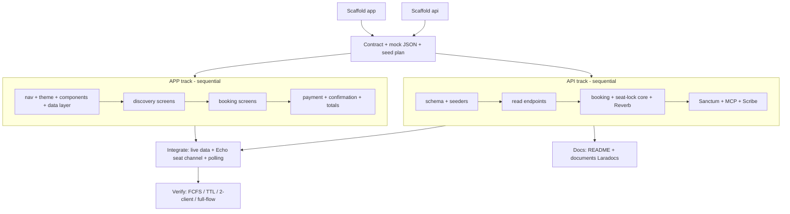

# SDP Cinema — Development Plan (agent-parallelized build)

Build target repo: `~/Documents/workspace/sdp-cinema` (origin `amirulbahriaziz/sdp-cinema`).
Specs live in graminis: `02-work/01-project/sdp-cinema/artifacts/ai-context/*.md` (source of truth).
Runnable workflow: `build.workflow.mjs` (run via the Workflow tool — `scriptPath`).

## Environment (verified)
- PHP 8.4 · Composer 2.9 · Node 24 · npx 11 · git 2.50
- **MySQL** running (Homebrew); DB `sdp_cinema` created (root, no password, local).
- **No Redis** → seat locks use a **DB UNIQUE constraint** (atomic, FCFS) instead of `SET NX`.
- **Laravel 12** (latest stable) · **Expo** (latest).

## Stack (from ai-context)
Laravel 12 API (route→controller→service→model; auth+validation in Form Requests; money = int minor
+ currency RM) · Reverb WebSocket + REST polling · Sanctum · Scribe API docs · Laravel MCP (dev) ·
Expo RN app (React Query for server data, Zustand for booking draft, live|mock data source w/
fallback) · `documents/` Laradocs (fallback plain Markdown) · Mermaid diagrams.

## Build strategy: 2 parallel tracks, each a sequential pipeline
`api/` and `app/` are different directories → safe to build **in parallel**. Within a track, steps
share files (routes, composer, navigation) so they run **sequentially** to avoid clobber. The app
track builds against **mock JSON** (= the API contract), so it never waits on the API. Tracks
converge only at real-time wiring.

> Note on "peak 6 fan-out": true 6-way parallel needs per-file partitioning or git-worktree
> isolation. The code repo is external (not graminis), so workflow worktree isolation does not apply
> to it. We therefore choose **track-level parallelism (api ∥ app)** — robust, still ~halves
> wall-clock vs sequential.

## Agents

| # | Task | Track | Phase | Runs with |
|---|---|---|---|---|
| 1 | Scaffold `api/` (Laravel 12 + reverb/sanctum/scribe/mcp) | api | Scaffold | ∥ #2 |
| 2 | Scaffold `app/` (Expo + RQ/zustand/echo/nav) | app | Scaffold | ∥ #1 |
| 3 | API contract → `app/mock/*.json` + `CONTRACT.md` + seed plan | shared | Contract (GATE) | solo |
| 4 | Migrations + models + seeders (all tables incl. price_tiers/seat_type_prices) → migrate+seed | api | API.1 | ∥ app track |
| 5 | Read endpoints (movies/cinemas/showtimes/seats/food) controller→service, FormRequest | api | API.2 | ∥ app track |
| 6 | **Booking + seat-lock core** (FCFS DB-unique lock, TTL, atomic confirm, dummy pay, Reverb event) | api | API.3 | ∥ app track |
| 7 | Sanctum auth + Laravel MCP (dev) + Scribe generate | api | API.4 | ∥ app track |
| 8 | Nav + theme.ts + components + data layer (live\|mock adapter, RQ, Zustand store) | app | APP.1 | ∥ api track |
| 9 | Discovery screens (Home, Movie Details, Reviews) | app | APP.2 | ∥ api track |
| 10 | Booking screens (Ticket Booking, Seat grid, F&B, Summary) | app | APP.3 | ∥ api track |
| 11 | Payment + Confirmation screens + totals wiring | app | APP.4 | ∥ api track |
| 12 | Integrate: flip app to live API + `useSeatChannel` (Echo/Reverb) + polling fallback | both | Integrate | ∥ #13 |
| 13 | Docs: root `README.md` (setup+run both) + `documents/` (Laradocs→Markdown fallback) from ai-context | docs | Docs | ∥ #12 |
| 14 | Verify: Pest FCFS concurrency test, TTL release, 2-client live, full-flow smoke | verify | Verify | solo |

**Peak concurrency:** 2 tracks (api ∥ app) + docs overlap ≈ 2–3 agents. ~14 agent tasks total.

## Timing (agent wall-clock, parallel)
Scaffold ~5m · Contract ~5m · API∥APP pipelines ~30–40m · Integrate ~10m · Docs ~10m (∥) ·
Verify ~10m → **~1–1.5h** to a testable api **and** app. API testable first (~after API.2).

## Commit policy (assessment §5 — commit frequently)
- Commit after **every step/agent** lands, into `amirulbahriaziz/sdp-cinema`.
- Small + verbose, **Conventional Commits**: `feat(api-seatlock): ...`, `feat(app-seats): ...`,
  `chore(scaffold): ...`, `docs(readme): ...`, `test(concurrency): ...`.
- Message body explains the "why" when not obvious. **No co-author / no AI branding** (graminis rule).
- Push / open PR via `graminis:project-pr` when the user asks.

## Local test (after build)
- **api/**: `composer install` · copy `.env` (DB=mysql `sdp_cinema`) · `php artisan key:generate` ·
  `php artisan migrate --seed` · `php artisan reverb:start` · `php artisan serve` · Scribe docs at
  `/docs` · Laravel MCP for dev.
- **app/**: `npm install` · set API base URL + data-source mode in `.env` · `npx expo start` ·
  toggle **live | mock** · run **two clients** to demo the real-time lock.
- **documents/**: build/serve the docs site.
