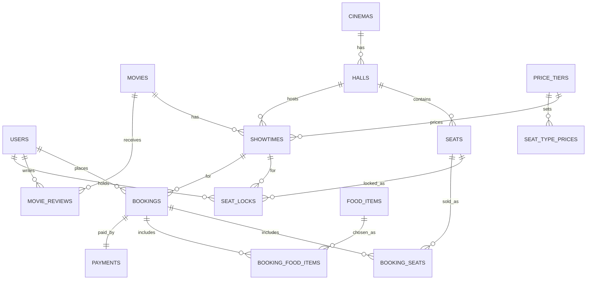
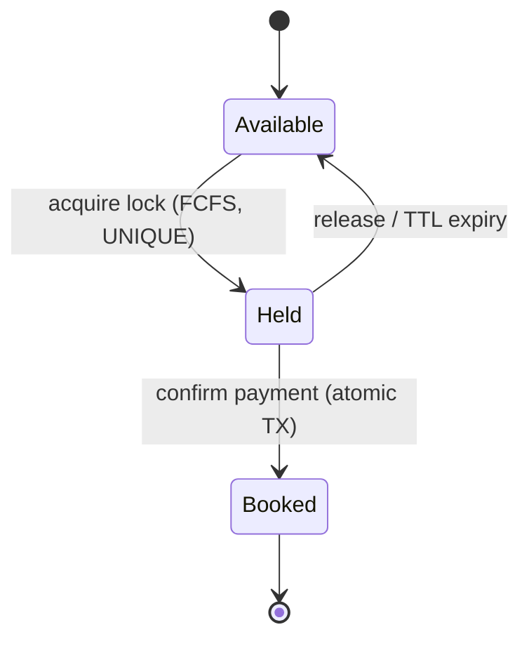
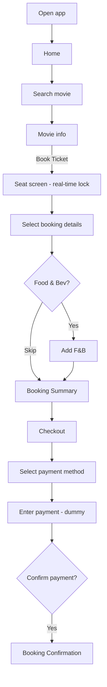

# Architecture Context

## Stack

| Layer        | Technology                                   | Role                                          |
| ------------ | -------------------------------------------- | --------------------------------------------- |
| API          | Laravel 12 (PHP)                             | Stateless REST API + business logic           |
| Real-time    | Laravel Reverb (WebSocket) + REST polling    | Push seat lock/release/book events; fallback  |
| Auth         | Laravel Sanctum (bearer token)               | Stateless token auth — no server session      |
| Database     | MySQL (Eloquent migrations)                  | Source of truth for all entities              |
| Lock store   | Redis (`SET NX EX`) or DB unique constraint  | Atomic FCFS seat hold + TTL expiry            |
| API docs     | Scribe (knuckleswtf/scribe)                  | Browsable HTML docs + try-it-out; OpenAPI + Postman|
| Dev tooling  | Laravel MCP (`laravel/mcp`)                  | Expose API as MCP tools for AI-assisted dev/test   |
| Client       | React Native via Expo                        | Mobile app for every flowchart screen         |
| Client data  | React Query + Zustand                        | RQ = server data/cache/polling; Zustand = booking draft|
| Client RT    | laravel-echo + pusher-js (Reverb protocol)   | Subscribe to per-showtime seat channel        |

## System Boundaries

- `api/` — Laravel app: migrations, models, controllers, broadcast events, seeders, Scribe docs.
- `app/` — Expo app: screens, components, navigation, api client, realtime client, booking store.
- `app/mock/` — bundled JSON fixtures; a *selectable* data source (see Data Source), not just a
  pre-wiring stopgap (satisfies 4.1).
- `documents/` — docs site (**Laradocs**) generated from `ai-context`; **Mermaid** diagrams. Sits
  beside `api/` and `app/`.
- Repo root — detailed `README.md` (setup + run for api and app); the apps are independent
  deployables in one monorepo.

## Storage Model

- **Relational DB (Eloquent)**: all durable entities — users, movies, cinemas, halls, seats,
  showtimes, bookings, booking_seats, booking_food_items, food_items, payments, movie_reviews.
- **Seat-lock store (Redis or `seat_locks` table)**: transient holds only, TTL-bounded. Never the
  source of truth for *sold* seats — that is `booking_seats`.
- **No server memory state**: every request reconstructs context from the DB/Redis + bearer token.
- **Money**: stored as **integer minor units + a `currency` code** (values in **MYR / RM**) on every
  money-bearing row. No float arithmetic on totals anywhere. (Wireframe shows NGN ₦; app uses RM.)

## Data Model (ERD)

Entities (FKs marked ->):

| Entity               | Key fields                                                                                          | Notes                                              |
| -------------------- | --------------------------------------------------------------------------------------------------- | -------------------------------------------------- |
| users                | id, name, email, password                                                                           | Sanctum auth                                       |
| movies               | id, title, synopsis, duration_min, release_date, age_rating, imdb_rating, poster_url, trailer_url, genres, casts, director, writers | Home + Movie Details            |
| movie_reviews        | id, movie_id->movies, user_id->users, rating(1-5), title, body                                      | Ratings & Reviews tab                              |
| cinemas              | id, name, city, address                                                                             | "Genesis Deluxe Lagos : Maryland mall"             |
| halls                | id, cinema_id->cinemas, name                                                                         | physical screen                                    |
| seats                | id, hall_id->halls, seat_code("A3"), row_label, col_num, type(standard/premium), active             | one row per seat; UNIQUE(hall_id, seat_code)       |
| showtimes            | id, movie_id->movies, hall_id->halls, starts_at, ends_at, tier_id->price_tiers                       | a screening; tier sets seat pricing                |
| price_tiers          | id, name(Classic/Premium), currency(MYR)                                                            | the two selectable tier cards                      |
| seat_type_prices     | id, tier_id->price_tiers, seat_type(standard/premium), price(int minor)                              | price per (tier, seat type); card range = MIN..MAX |
| seat_locks           | id, showtime_id->showtimes, seat_id->seats, holder_id->users, expires_at                            | transient FCFS hold; UNIQUE(showtime_id, seat_id)  |
| bookings             | id, user_id->users, showtime_id->showtimes, status(pending/confirmed/cancelled), subtotal, service_charge, food_total, total, currency, promo_code | order header; all amounts int minor units |
| booking_seats        | id, booking_id->bookings, seat_id->seats, unit_price(int minor)                                      | sold seats, priced by seat type; UNIQUE(showtime, seat)|
| food_items           | id, category(combo/food_snacks/beverages), name, description, price(int minor), discount_price, currency, image_url | F&B catalog                          |
| booking_food_items   | id, booking_id->bookings, food_item_id->food_items, qty, unit_price(int minor)                       | F&B line items                                     |
| payments             | id, booking_id->bookings, method(card/bank/crypto), amount(int minor), currency, status, reference   | dummy/stub                                        |

**Relationships:** cinema 1-* halls; hall 1-* seats; hall 1-* showtimes; movie 1-* showtimes;
movie 1-* movie_reviews; user 1-* {bookings, reviews}; showtime 1-* seat_locks; showtime 1-*
bookings; seat 1-* seat_locks; seat 1-* booking_seats; booking 1-* booking_seats; booking 1-*
booking_food_items; booking 1-1 payment; food_item 1-* booking_food_items; price_tier 1-* showtimes; price_tier 1-* seat_type_prices.

**Pricing (Option B):** a seat's price = `lookup(showtime.tier, seats.type)` from `seat_type_prices`;
a tier card's range = MIN..MAX of that tier's seat-type prices; `booking_seats.unit_price` stores the
resolved per-seat price. Currency = **MYR (RM)**.

## Seat State Machine

A seat's status is **per showtime**, derived — never a flag on the physical `seats` row:

```
AVAILABLE   no lock row, no booking_seat for (showtime, seat)
   |  acquire -> INSERT seat_locks(showtime, seat, holder, expires=+5m)   [broadcast HELD]
HELD
   |-- release / TTL expiry -> DELETE seat_locks row                       [broadcast AVAILABLE]
   '-- confirm pay -> TX{ booking confirmed, INSERT booking_seats,
                          DELETE seat_locks }                              [broadcast BOOKED]
BOOKED      booking_seats row permanent; UNIQUE(showtime, seat) = sold once ever
```

Live seat map for a showtime = `seats` of the hall, LEFT-joined to that showtime's `booking_seats`
(-> booked) and active non-expired `seat_locks` (-> held); everything else available.

## Data Source (live | mock)

The app reads through one data interface backed by two interchangeable adapters:

- **`live`** — HTTP calls to the Laravel API.
- **`mock`** — reads bundled `app/mock/*.json` (no network).

The active source is **selectable at runtime** (config flag / dev toggle). On a live request
failure (API down/unreachable), the layer **automatically falls back to `mock`** so the app stays
fully demoable offline. Screens and React Query hooks are source-agnostic — they call the
interface, not a specific adapter. (Realtime seat-lock only works in `live` mode; in `mock` the
seat map is static.)

## Auth and Access Model

- Every authenticated request carries a **Sanctum bearer token**; the server holds no session.
- A `seat_locks` row is owned by its `holder_id`; only the holder may release it (or TTL expires it).
- Only the booking's owner may view/confirm that booking.

## Invariants

1. **No server-side session/memory state** — statelessness is mandatory (assignment 4.3).
2. **A seat is held by at most one user per showtime** — enforced by `UNIQUE(showtime_id, seat_id)`
   on `seat_locks` (acquire is atomic; the loser gets `409`).
3. **A seat is sold at most once per showtime** — enforced by uniqueness on `booking_seats`.
4. **Every seat-state change broadcasts** a real-time event on the showtime's channel.
5. **Holds expire** — no abandoned hold may block a seat indefinitely (TTL ~5 min).
6. Confirm = atomic transaction: booking->confirmed + booking_seats insert + seat_locks delete all
   succeed or all roll back.


## Dev Tooling — Laravel MCP

- **Laravel MCP** (`laravel/mcp`) is wired into the API to expose selected resources/actions as MCP
  tools for AI-assisted development and testing.
- **Scope: dev-time assist only** — not a shipped product surface. Disabled/guarded in production.

## Documentation Site — `documents/`

- A `documents/` directory sits at the same level as `api/` and `app/`.
- It hosts a docs site built with **Laradocs**, **generated from the `ai-context` markdown** — the
  `artifacts/ai-context/*.md` files remain the single source of truth; `documents/` renders them as
  the public git docs.
- All diagrams are **Mermaid** (see below). Keep `ai-context` and `documents/` in sync: edit the
  context docs, regenerate the site.
- If "Laradocs" is not an installable package, fall back to a **plain Markdown docs site** (the
  `ai-context` files rendered as-is). Not Larecipe.

## Diagrams (Mermaid)

These are the canonical diagrams; the `documents/` site renders them.

### ERD



### Seat state machine (per showtime x seat)



### Booking flow (from the wireframe flowchart)


