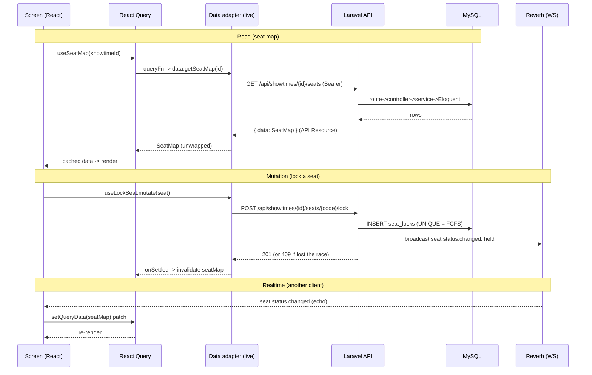
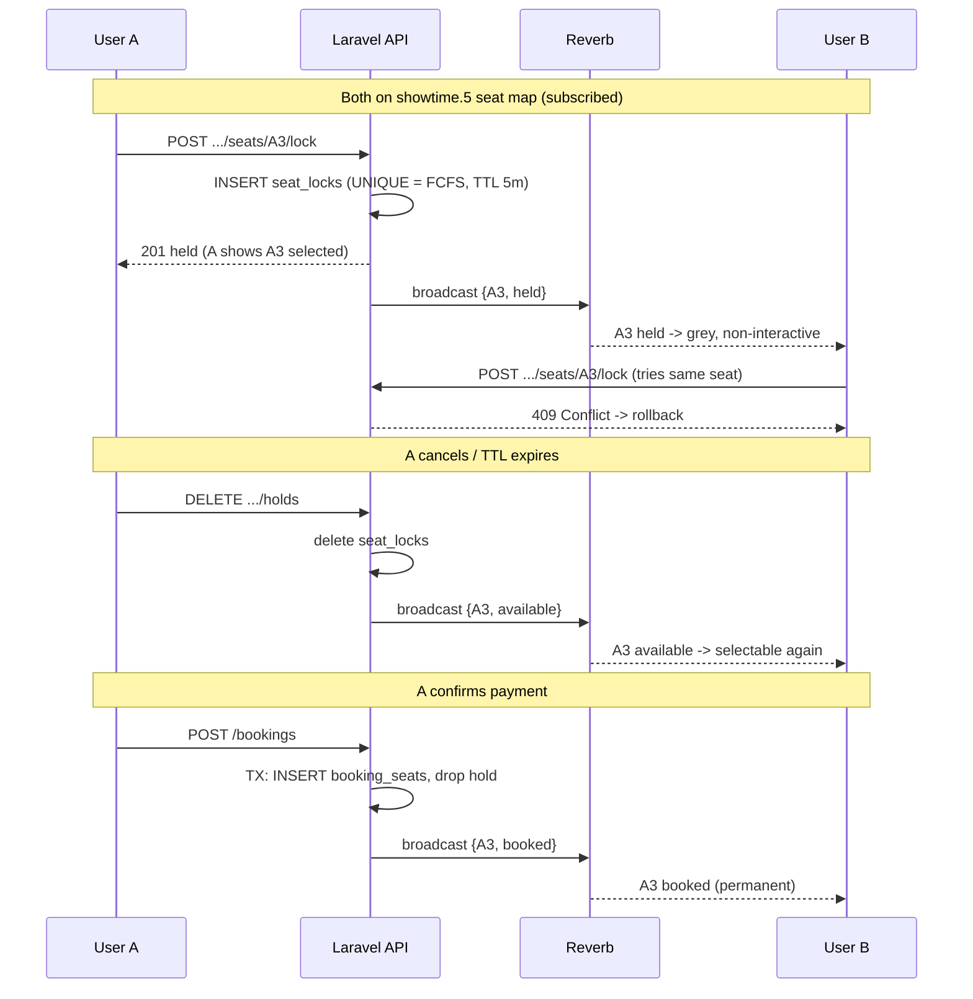

# Data Flow

How data moves between the Expo app and the Laravel API — the full **request → fetch → store →
render** loop, plus how mutations and realtime updates flow back.

## The short version

- **React Query owns server truth** (movies, showtimes, seat map): fetching, caching, refetch.
- **Zustand owns client intent** (the booking draft: selected seats, F&B, totals).
- Screens read both and render them together — they never call the network directly.
- **Live is strictly live** (no silent mock fallback); the source is chosen by
  `EXPO_PUBLIC_DATA_SOURCE` (`live` | `mock`).
- All money is **integer minor units + a `currency` code** (RM) — never floats.

## Read path (e.g. loading the seat map)

1. A screen calls a **React Query hook** — `useMovies` / `useShowtimes` / `useSeatMap`
   (`src/api/hooks.ts`).
2. The hook's `queryFn` calls the **active data adapter** — `data.getSeatMap(id)`
   (`src/data/index.ts` picks `live` or `mock`).
3. The **live adapter** (`src/data/live.ts`) does an `axios` GET to `/api/...`; a request
   interceptor attaches the **Sanctum bearer token**.
4. Laravel handles it **route → controller → service → Eloquent model → MySQL**, then an
   **API Resource** wraps the result in a `{ data: ... }` envelope.
5. The adapter **unwraps** `res.data.data` into a plain domain object.
6. **React Query caches** it under a stable `queryKey` (`src/api/query-client.ts`,
   `staleTime: 30s`).
7. The component reads `data` from the hook and **renders**.

## Mutation path (lock / release / book / cancel)

1. A screen action fires a **mutation** — `useLockSeat` / `useReleaseSeat` / `useCreateBooking` /
   `useCancelHolds`.
2. The adapter does a `POST` / `DELETE` to the API.
3. The controller delegates to a **service** that runs the change **atomically** (DB unique
   constraints are the arbiter — e.g. `UNIQUE(showtime_id, seat_id)` makes seat locking FCFS).
4. The server **broadcasts** a `SeatStatusChanged` event over Reverb.
5. On `onSettled`, the mutation **invalidates** the `seatMap` query → React Query refetches.

## Realtime path (another user's change appears live)

1. Reverb pushes `seat.status.changed` on the per-showtime channel.
2. `useSeatChannel` (`src/realtime/use-seat-channel.ts`, laravel-echo) receives it and
   **patches the React Query cache** directly via `setQueryData` — no refetch needed.
3. The component re-renders with the new seat status.
4. **Fallback:** if the socket is down, `useSeatMap`'s `refetchInterval` polls (5s down / 15s up)
   so the grid still converges.

## State split — server truth vs client intent

| Concern | Owner | Examples |
|---|---|---|
| Server data | **React Query** | movies, movie details, showtimes, **seat map**, food items |
| Client intent (draft) | **Zustand** (`src/store/booking.ts`) | selected seats, F&B quantities, promo, totals |

They merge at render: e.g. `SeatMap` overlays the client-only `selected` status on top of the
server-provided `available` / `held` / `booked` statuses. Totals in the store are advisory — the
**API recomputes them server-side** on booking confirm.

## Where the fetched data is stored (client-side)

Everything is **in-memory** — this build persists nothing to device storage:

- **Server data** → the **React Query cache** (the in-memory `QueryClient`,
  `src/api/query-client.ts`), keyed by `queryKey` with a 30s `staleTime`. The realtime patcher
  (`setQueryData`) and `onSettled` invalidations target these same keys.
- **Booking draft** → the **Zustand store** (`src/store/booking.ts`) — plain JS memory.
- **Sanctum token** → a module-level variable in `src/data/live.ts`, set after the auto-login in
  `AppProviders`.

There is no `AsyncStorage` / MMKV / SQLite / `localStorage` — nothing is written to disk. So on a
reload or restart the caches start empty: React Query **refetches** from the API, the draft resets,
and the app re-logs-in. (Persisting would mean adding `AsyncStorage` + RQ's `persistQueryClient`, or
Zustand's `persist` middleware — intentionally not done here.)

## Diagram

## Real-time seat-lock scenario (the §1.0 core)

The graded feature: while User A is booking, **everyone else's seat map updates live**. Two users
(A and B) both have the showtime's Select Seats screen open — each is subscribed to the Reverb
channel `showtime.{id}`.

1. **A selects A3.** The client optimistically shows A3 as `selected` (its own accent color), then
   `POST .../seats/A3/lock`. The server inserts a `seat_locks` row — `UNIQUE(showtime_id, seat_id)`
   makes this **first-come-first-serve** — with a ~5-minute TTL, and **broadcasts** `{A3, held}`.
2. **B sees A3 lock instantly.** B's `useSeatChannel` patches the cache → A3 turns grey (`held`) and
   becomes non-interactive. B never holds it.
3. **B taps A3 anyway → loses the race.** `POST .../seats/A3/lock` returns **409 Conflict**; B's
   optimistic selection rolls back with a "seat taken" message.
4. **A cancels (or the TTL expires).** `DELETE .../holds` deletes the lock and broadcasts
   `{A3, available}` → A3 reopens on B's grid within ~1s.
5. **A pays.** `POST /bookings` promotes the hold into `booking_seats` in one transaction and
   broadcasts `{A3, booked}` → A3 is permanently sold for everyone.

> A's **own** seat shows as `selected` (its color), never `held` — `held` is what *other* clients
> see. If the socket drops, the 5s polling fallback still converges every client.

